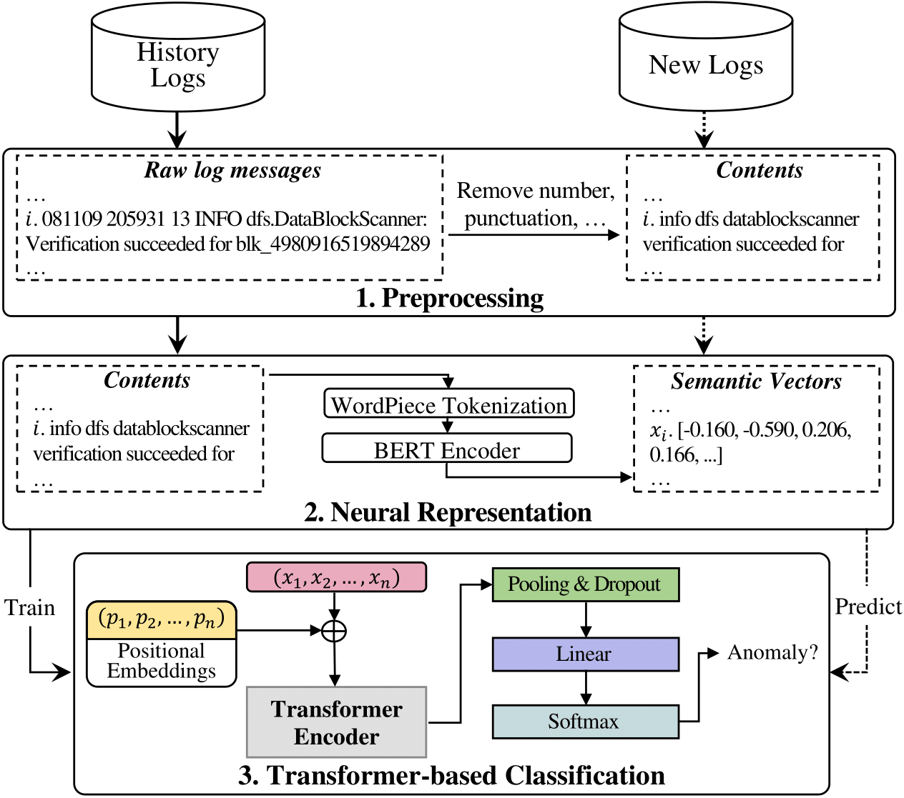
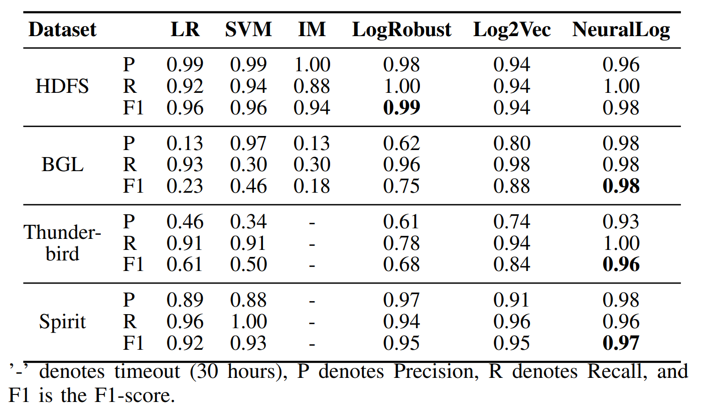

# NeuralLog
Repository for the paper: Log-based Anomaly Detection Without Log Parsing.

**Abstract**: Software systems often record important runtime information in system logs for troubleshooting purposes. There have been many studies that use log data  to construct machine learning models for detecting system anomalies. Through our empirical study, we find that existing log-based anomaly detection approaches are significantly affected by log parsing errors that are introduced by 1) OOV (out-of-vocabulary) words, and 2) semantic misunderstandings. The log parsing errors could cause the loss of important information for anomaly detection. To address the limitations of existing methods, we propose NeuralLog, a novel log-based anomaly detection approach that does not require log parsing. NeuralLog extracts the semantic meaning of raw log messages and represents them as semantic vectors. These representation vectors are then used to detect anomalies through a Transformer-based classification model, which can capture the contextual information from log sequences. Our experimental results show that the proposed approach can effectively understand the semantic meaning of log messages and achieve accurate anomaly detection results. Overall, NeuralLog achieves F1-scores greater than 0.95 on four public datasets, outperforming the existing approaches.

## Framework


NeuralLog consists of the following components:
1. **Preprocessing**: Special characters and numbers are removed from log messages.
2. **Neural Representation**: Semantic vectors is extracted from log messages using BERT.
3. **Transformer-based Classification**: A transformer-based classification model containing Positional Encoding and
 Transformer Encoder is applied to detect anomalies.

## Requirements
1. Python 3.6+
2. tensorflow 2.4
3. transformers
4. tf-models-official 2.4.0
5. ...
## Demo
- Extract Semantic Vectors

```python
from neurallog import data_loader

log_file = "../data/raw/BGL.log"
emb_dir = "../data/embeddings/BGL"

(x_tr, y_tr), (x_te, y_te) = data_loader.load_Supercomputers(
     log_file, train_ratio=0.8, windows_size=20,
     step_size=5, e_type='bert')
```
- Train/Test Transformer Model

See [notebook](demo/Transformer_based_Classification.ipynb)
## Results

## Data and Models
[Lastest release](/releases/latest)
